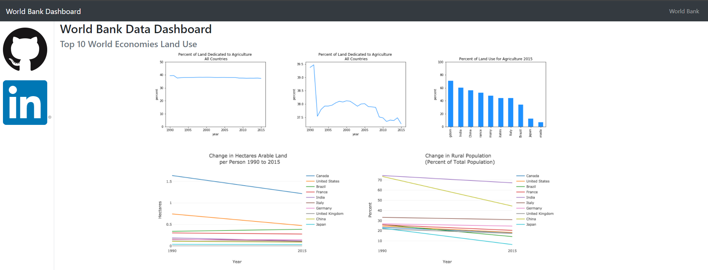

# Use Bootstrap to create a front-end template for a data dashboard 

In this step, we use the templates from Bootstrap library to build a front-end webpage for hosting 
data dashboard for World Bank data.

Resources:
+ `index.html` file: contains template for the front-end creation
+ `assets` folder: contains images used to render for this step

Here is the example of how the output of the Bootstrap template look like:
